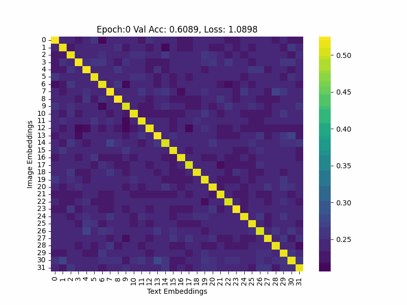
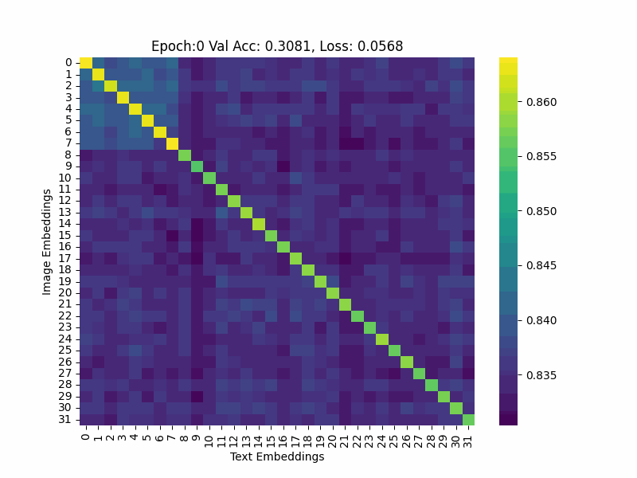

# CLIP
A novel approach the loss function of the CLIP model

## Base CLIP similarity matrix during the training]

## Compensated CLIP similarity matrix during the training

## Files and directory

- data.ipynb downloads all data for training and measurement
- pre-embedding.ipynb embeddeds all data to faster training
- train.ipynb  trains the models
- results.ipynb visualizes and show all results
- test.ipynb tests the trained models
- results stores all saved results